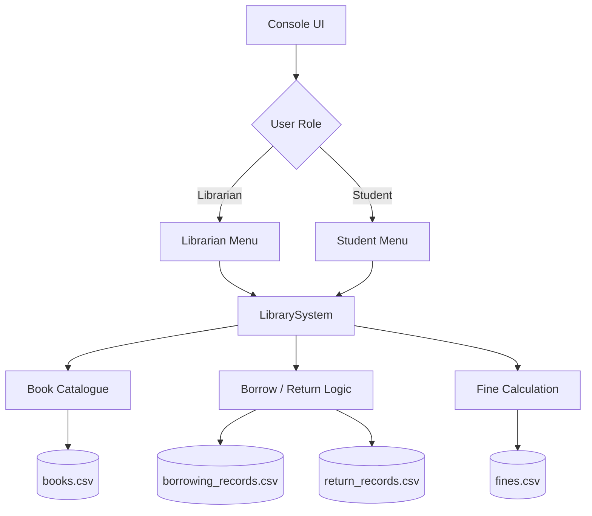

# 📚 Library Management System — C++

[](https://isocpp.org/)
[](https://github.com/ibrahimm2106/Software-Development-2/actions/workflows/build.yml)
[](#quick-start)
[](#data-persistence)

A console-based **library management system built in modern C++** to demonstrate object-oriented programming, file persistence, input validation, date handling, exception handling and role-based application logic.

> **Project context:** originally developed as an individual Software Development 2 university coursework project. The repository has since been reorganised and refactored into a cleaner portfolio format while preserving the project’s core requirements and C++ focus.

## ✨ What this project demonstrates

- **Object-oriented design** with encapsulated `Book` and `LibrarySystem` responsibilities
- **C++ Standard Library** usage (`vector`, `filesystem`, streams, algorithms, chrono/time utilities)
- **Persistent CSV storage** for catalogue, borrowing, returns and fines
- **Role-based menus** for students and librarians
- **Input validation & exception handling** for numeric, text, date and file operations
- **Case-insensitive search** by Book ID or title
- **Transaction tracking** with unique borrowing IDs and due dates
- **Business rules** including 14-day loans and **£0.20/day overdue fines**
- **Cross-platform build configuration** using CMake and C++17
- **Continuous integration** compile checks on Windows and Ubuntu

## 🧭 Quick navigation

- [Features](#-features)
- [Architecture](#-architecture)
- [Quick start](#-quick-start)
- [How to use](#-how-to-use)
- [Data persistence](#-data-persistence)
- [Project structure](#-project-structure)
- [Testing](#-testing)
- [Skills demonstrated](#-skills-demonstrated)

## 🚀 Features

| Area | Capability |
|---|---|
| Catalogue | Register books with ID, title, author, year, publisher, copy counts and subject |
| Search | Find books by ID or partial title, regardless of capitalisation |
| Borrowing | Borrow available books and record borrower, date and 14-day due date |
| Returns | Match an active borrowing record, restore inventory and record the return |
| Fines | Calculate overdue charges at **£0.20 per day after 14 days** |
| Records | Search borrowing, return and fine records by Book ID or borrower |
| Validation | Reject empty fields, invalid ranges, impossible dates and malformed input |
| Persistence | Save application state to human-readable CSV files |

<details>
<summary><strong>👤 Role permissions</strong></summary>

### Librarian
- Register new books
- Search the catalogue
- Borrow and return books
- Search borrowing, return and fine records

### Student
- Search the catalogue
- Borrow and return books
- Search borrowing, return and fine records

Book registration is intentionally restricted to librarians.
</details>

## 🏗 Architecture



The application keeps domain data encapsulated inside C++ classes and uses relative `data/` paths so it can run from a cloned repository without machine-specific file locations.

## ⚡ Quick start

### Option 1 — CMake (recommended)

**Requirements:** CMake 3.16+ and a C++17 compiler such as Visual Studio/MSVC, GCC or Clang.

```bash
git clone https://github.com/ibrahimm2106/Software-Development-2.git
cd Software-Development-2
cmake -S . -B build
cmake --build build --config Release
```

Run the executable from the generated `build` directory.

### Option 2 — Visual Studio

1. Clone or download the repository.
2. Open the repository folder in Visual Studio.
3. Configure the folder as a CMake project if prompted.
4. Select `library_management_system` as the startup target.
5. Build and run.

## 🖥 How to use

When the program starts, choose a role:

```text
=== Stepwise University Library Management System ===
C++ console application | CSV persistence | Role-based menus

Select user type:
1. Librarian
2. Student
0. Exit
Choice:
```

A typical borrowing flow is:

```text
Book ID: 1002
Borrower name or student/staff ID: S12345
Borrowing recorded successfully.
Transaction: TX-1002-...
Due date:    2026-09-03
```

On return, the program finds the matching active borrowing transaction, validates the date, updates the catalogue and calculates any overdue fine automatically.

## 💾 Data persistence

Runtime data is stored as CSV so the records are easy to inspect outside the application:

| File | Purpose |
|---|---|
| `data/books.csv` | Book catalogue and copy availability |
| `data/borrowing_records.csv` | Borrowing transactions and due dates |
| `data/return_records.csv` | Completed returns and late-day calculations |
| `data/fines.csv` | Persisted overdue fine records |

The repository includes a small sample catalogue so the program can be demonstrated immediately.

## 📁 Project structure

```text
Software-Development-2/
├── .github/
│   └── workflows/
│       └── build.yml
├── data/
│   ├── books.csv
│   ├── borrowing_records.csv
│   ├── fines.csv
│   └── return_records.csv
├── docs/
│   └── TESTING.md
├── src/
│   └── main.cpp
├── .gitignore
├── CMakeLists.txt
└── README.md
```

## 🧪 Testing

The repository contains a documented manual test plan covering successful flows, invalid input, duplicate IDs, unavailable books, late returns, record searching and boundary cases.

➡️ See [`docs/TESTING.md`](docs/TESTING.md).

GitHub Actions also compiles the project on **Windows and Ubuntu** on each push/pull request to `main`.

## 🧠 Skills demonstrated

`C++17` · `Object-Oriented Programming` · `Encapsulation` · `STL` · `File I/O` · `CSV Parsing` · `Input Validation` · `Exception Handling` · `Date Handling` · `Algorithms` · `CMake` · `Git/GitHub` · `Testing`

## 🔍 Key implementation decisions

<details>
<summary><strong>Why relative file paths?</strong></summary>

Using `data/...` instead of a hard-coded Windows user path makes the project portable and allows another developer or recruiter to clone and run it without editing the source code.
</details>

<details>
<summary><strong>How are overdue fines calculated?</strong></summary>

Each borrowing record receives a due date 14 days after the borrowing date. On return:

```text
late days = max(0, return date - due date)
fine      = late days × £0.20
```

Late fines are written to `data/fines.csv`.
</details>

<details>
<summary><strong>How does the program avoid duplicate returns?</strong></summary>

Borrowing transactions have unique transaction IDs. A loan is considered active only when its transaction ID does not yet appear in the return records, preventing the same transaction from being returned twice.
</details>

## 📌 Portfolio note

This repository is intended to show the development skills and concepts demonstrated through the project. The implementation has been cleaned up for readability and maintainability, including portable paths, clearer validation, documented testing and a reproducible build process.
